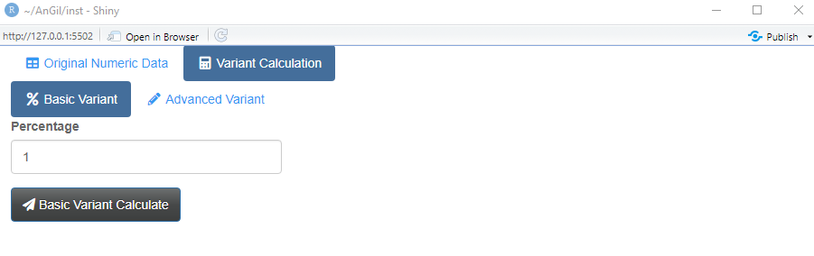
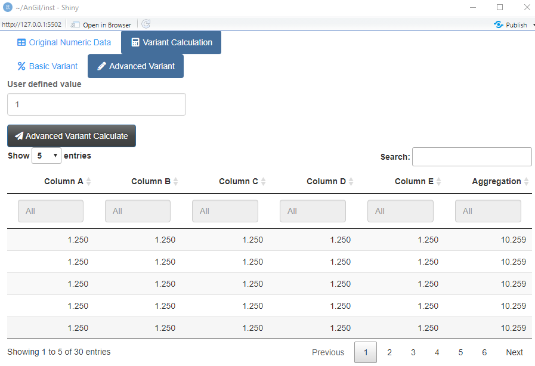

AnGil
================
Edward Gillian
10/04/2022

The package `AnGil` does a number of tasks:

First, this package allows the user to create sample data in an
aggregated manner

Next, this package allows the user to adjust the data in aggregated
manner using a `basic variant calculation` and `advanced variant
calculation`. The `basic variant calculation` allows the user to adjust
inputs by providing a percentage of original value. The `advanced
variant calculation` allows the user to adjust inputs by providing a
user defined value.

The `basic variant calculation` and `advanced variant calculation` have
interconnected input parameters so that change in one parameter affects
the other.

## Installation

You can install the released version of `AnGil` with:

``` r
devtools::install_github("EdwardJGillian/AnGil")
```

## Running the package

You can run `AnGil` by opening either `ui.R` or `server.R` in the
`AnGil/inst` folder.

## Example

This is a basic example of the workflow with package functions. We will
start by opening the package. When you open the package, it loads the
data, calculates the aggregated data, and displays in the `Original
Numeric Data` tab.

 At the same time, the `Basic Variant`
tab and the `Advanced Variant` tab are populated.



Then, you can enter a percentage figure in `Percentage` field and click
`Basic Variant Calculation` button. This populates the `basic variant`
view:


The above figure shows the results for 125% of the original values.

Then, you can enter a value in `user defined value` field and click
`Advanced Variant Calculation` button. This populates the `advanced
variant` view:



As can be seen by the screen shots, the `Percentage` parameter and the
`user defined value` parameters are interconnected as the `advanced
variant` view shows the values `1.25` instead of `1` as the `Percentage`
value is `125%`.
